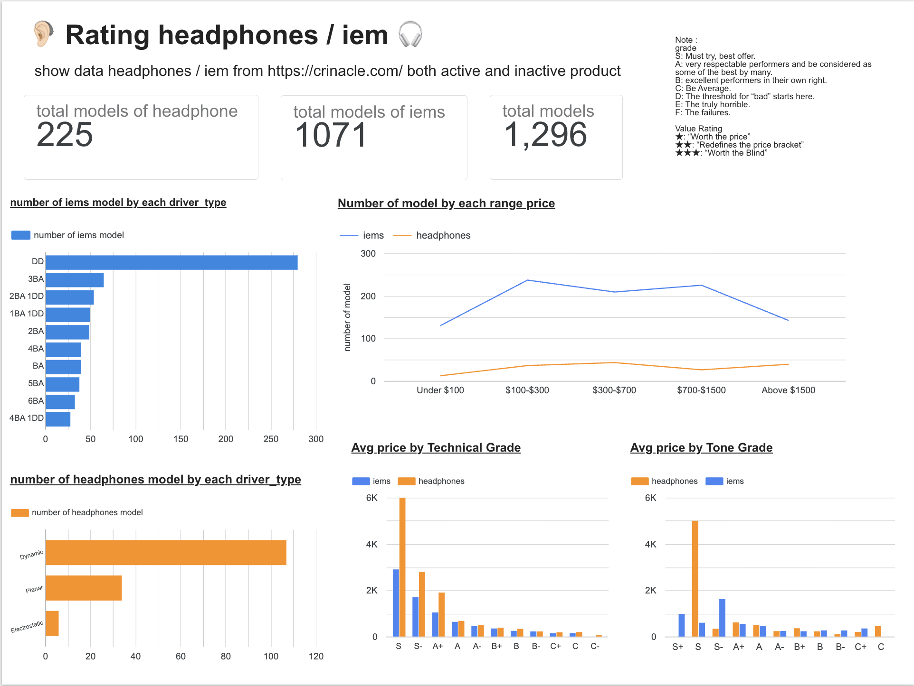

# 🎧 Audiophile E2E Pipeline

An end-to-end data pipeline that scrapes headphone & IEM ranking data from [Crinacle's rankings](https://crinacle.com/rankings/), loads it into ClickHouse, transforms it with dbt, and visualizes the results in Google Data Studio (Looker Studio).

Built as a homework project to practice orchestration, data warehousing, transformation, and BI in one stack.

 Make Airflow + dbt + ClickHouse + Google Data Studio with audiophile data, and answer:

## 📊 Live Dashboard

**[Rating Headphones / IEM Dashboard →](https://datastudio.google.com/u/0/reporting/ca510186-1918-4b49-8053-7f9be086818e/page/eBM9F/edit)**


## 🏗️ Architecture

```
Crinacle.com (scrape)
        │
        ▼
┌─────────────────┐
│  Apache Airflow  │  orchestrates the whole pipeline (Celery executor)
└────────┬─────────┘
         │
         ▼
   scrape → validate & clean → load raw data
         │
         ▼
┌─────────────────┐
│    ClickHouse    │  raw_audiophile table (String columns)
└────────┬─────────┘
         │  dbt (via Cosmos)
         ▼
┌─────────────────┐
│   dbt models      │  staging → marts (typed, cleaned, aggregated)
└────────┬─────────┘
         │
         ▼
┌─────────────────┐
│ Google Data Studio │  dashboard & charts
└──────────────────┘
```

## ⚙️ Tech Stack

| Layer | Tool |
|---|---|
| Orchestration | [Apache Airflow](https://airflow.apache.org/) 3.2.1 (Celery Executor) |
| Scraping | `requests` + `BeautifulSoup4` |
| Data Warehouse | [ClickHouse](https://clickhouse.com/) 25.6 |
| Transformation | [dbt](https://www.getdbt.com/) via [`dbt-clickhouse`](https://github.com/ClickHouse/dbt-clickhouse) & [Astronomer Cosmos](https://astronomer.github.io/astronomer-cosmos/) |
| Object storage | [MinIO](https://min.io/) |
| Metadata DB / broker | PostgreSQL + Redis |
| Visualization | Google Data Studio (Looker Studio) |
| Containerization | Docker Compose |

## 🔄 Pipeline (DAG: `audiophile_e2e_pipeline`)

The DAG lives at [`dags/main_dag.py`](dags/main_dag.py) and runs the following tasks in sequence:

1. **`scrape_audiophile_data`** — scrapes the headphones and IEMs ranking tables from `https://crinacle.com/rankings/`, cleans up column headers, drops internal sort-helper columns, and writes a raw CSV.
2. **`validate_and_clean`** — drops empty rows and produces a cleaned CSV.
3. **`load_to_clickhouse`** — dynamically creates a `raw_audiophile` table in ClickHouse (all `String` columns, ordered by `device_type`) and bulk-inserts the cleaned data.
4. **`dbt_transform`** (task group, powered by Cosmos) — runs the dbt project (`staging` views → `marts` tables) on top of the raw ClickHouse table to produce clean, typed, analysis-ready models.

The DAG is manually triggered (`schedule=None`) — run it on demand from the Airflow UI.

## 📁 Project Structure

```
.
├── dags/
│   └── main_dag.py          # Airflow DAG: scrape → clean → load → dbt transform
├── dbt/
│   ├── dbt_project.yml      # dbt project config (staging → views, marts → tables)
│   ├── profiles.yml         # dbt connection profile for ClickHouse
│   └── models/              # staging & mart models
├── config/                  # Airflow config (airflow.cfg)
├── docker-compose.yaml      # Full local stack: Airflow, ClickHouse, MinIO, Postgres, Redis
└── .gitignore
```

## 🚀 Getting Started

### Prerequisites
- Docker & Docker Compose
- At least 4 GB RAM / 2 CPUs / 10 GB free disk available to Docker
- A `.env` file in the project root (see below)

### 1. Set up environment variables

Create a `.env` file in the project root:

```env
AIRFLOW_UID=50000
FERNET_KEY=<generate with: python -c "from cryptography.fernet import Fernet; print(Fernet.generate_key().decode())">
_AIRFLOW_WWW_USER_USERNAME=airflow
_AIRFLOW_WWW_USER_PASSWORD=airflow
```

### 2. Initialize Airflow

```bash
docker compose up airflow-init
```

### 3. Start the stack

```bash
docker compose up -d
```

This spins up: Airflow (API server, scheduler, DAG processor, worker, triggerer), PostgreSQL, Redis, MinIO, and ClickHouse.

### 4. Add the ClickHouse connection in Airflow

In the Airflow UI → **Admin → Connections**, add a connection:

| Field | Value |
|---|---|
| Connection Id | `clickhouse_conn` |
| Connection Type | HTTP / ClickHouse |
| Host | `clickhouse` |
| Port | `8123` |
| Login | `default` |
| Password | `clickhouse` |

### 5. Access the services

| Service | URL | Credentials |
|---|---|---|
| Airflow UI | http://localhost:8080 | `airflow` / `airflow` (default, override via `.env`) |
| ClickHouse HTTP | http://localhost:8123 | `default` / `clickhouse` |
| MinIO Console | http://localhost:9001 | `minio` / `minio123` |
| Flower (optional) | http://localhost:5555 | run with `--profile flower` |

### 6. Trigger the pipeline

Go to the Airflow UI, unpause and trigger the `audiophile_e2e_pipeline` DAG.

## 📈 Data Model

Raw scraped data lands in ClickHouse as `raw_audiophile` (all `String` typed, one row per headphone/IEM model), covering fields such as `device_type`, `driver_type`, `fit`/`cup`, `price`, and Crinacle's tone/technical grades and value ratings.

dbt then transforms this into staging views and mart tables (e.g. models aggregated by price bracket, driver type, and grade) that power the Data Studio dashboard — total model counts, price distribution by range, average price by technical/tone grade, and model counts by driver type for headphones vs. IEMs.

## 📊 DashBoard



(In Role)
Now we want to re-search about audiophile for our new product. We have two choice between headphones and iems. This dashboard show 3 data that I thing it will help us for design our project . First , it show range audiophile price in the market for decide to set price for our new goods. Next, It show what driver type is poppular in audiophile. Last, It’s show avgrage price by each grade , tone and technical , for find which grade that user happy to buy.

(ในบทบาท)
ตอนนี้เรากำลังศึกษาข้อมูลเพื่อหูฟังอันใหม่ที่เราจะทำออกมา โดยเราเลือกไว้ 2 แบบคือ หูฟังและหูฟังอินเอียร์ โดยแดชบอร์ดที่เราทำออกมาจะโชว์ข้อมูล 3 อย่าง 1.โชว์ช่วงราคาของสินค้าที่สำรวจเพื่อดูว่าเราจะตั้งราคาของเราไว้ประมาณและหูฟัง 2 แบบนิยมตั้งราคาเท่าไหร่ 2.ประเภทของไดรฟ์เวอร์ที่ใช้ว่าหูช่วงแต่ละแบบนิยมใช้ไดรเวอร์แบบไหน 3.โทนและเทคนิกเกรดของหูฟังเพื่อเชคคุณภาพเทียบกับราคาเฉลี่ยที่ผู้ซื้อสบายใจจะจ่าย

(GAME Framework)
* Goal : Get idea and can set spac first draft for our new product
* Audience : designer and dev team who have knowlage about audiophile and can decide what we can do on it , on the price for make first prototy as fast as thay can
* Message : What is on the maket? What user feel happy for spent money on audiophile? 
* Expression : on line chart to see the trand and bar chart for compare what it good


* Goal (เป้าหมาย): ได้ไอเดียและสามารถวางสเปคแรกของสินค้าใหม่เราได้
* Audience (ผู้ใช้งาน): นักออกแบบและผู้พัฒนาสินค้าใหม่ที่มีความรู้และสามารถตัดสินใจได้ว่าอะไรที่เราสามารถทำได้ ในราคาที่ตั้งหรือราคาที่รับได้ เพื่อหาขอสรุปและออกโปรโตไทป์แรกให้เร็วที่สุด
* Message (สารสำคัญ):ตอนนี่่ตลาดเป็นยังไง? อะไรที่ทำให้ลูกค้าคุ้มค่าที่จะจ่ายให้กับหูฟัง?
* Expression (รูปแบบการนำเสนอ): กราฟเส้นเพื่อดูเทรนและแท่งเปรียบเทียบว่าสิ่งไหนดี

## 📝 Question

**What did you learn from this project?**
Data from source have 2 table but I pull to clickhouse together in 1 table so some column if it same meaning but difference name it pull for two so I must clean it before for make it in same column. Data from 2 table have text in field difference but same meaning (Discontinued กับ Discont.) so if i don't clean it, if i count Discontinued product it will incorrect because it doesn't count Discont. With Myself, I'm not good for set project, must back to see what the old project do to do this and in 4 step of this home work i think i do DBT is the best because I happy. when i code sql.

ข้อมูล 2 ตารางมี column ชื่อคนละอันทำให้ตอนดึงมา มันดึงมาไม่ถูก , เพราะเอาข้อมูล 2 ตารางมารวมกัน มันเลยทำให้บางครั้ง text ใน field ต่างกันแม้แต่ความหมายเดียวกัน (Discontinued กับ Discont.) ต้องระวังดีๆ ที่เรียนรู้จากตัวเองคือเป็นคน set up project ไม่เก่งเลย ต้องพึ่ง repro เก่าเป็นแบบถึงจะไปต่อได้ แล้วก็ ใน 4 อย่างที่ไป ส่วนที่คิดว่าทำได้ดีที่สุดคือ dbt เพราะเขียน sql ได้

**How would you improve it?**
I quite worry about airflow because I spent time on it so so long. I think from study project it have data already but this I must do it by myself from URL and just repro example so i think i must try hard on it.

ส่วนอื่นๆ ซึ่งจริงๆที่น่ากังวลจริงๆคือ airflow เป็นส่วนที่ใช้เวลานานที่สุด อาจเป็นเพราะอันนี้มันดึงจากข้างนอก ของที่เรียนมันมีข้อมูลในไฟล์ก็ต้องดูแบบจาก project ตัวอย่าง ซึ่งหนูว่าหนูยังทำ airflow ไม่ค่อยดี

**If you had to do it all over again, what would you do differently?**
I think i want to try pull it separate table (in this time i pull it together in one table) so if i must do it again it will try pull two table and do a lot of mart i think it so fun when i did it.

 airflow จะลองเขียนอีกแบบอันนี้เขียนดึงข้อมูล 2 ตารางมารวมเป็นอันเดียวใน clickhouse (หนูรู้สึกว่ามันน่าจะง่ายกว่า) ถ้าได้ทำใหม่จะลองดึงแยกกัน , ทำ mart เยอะๆ เยอะอีก หนูว่ามันสนุกดี
